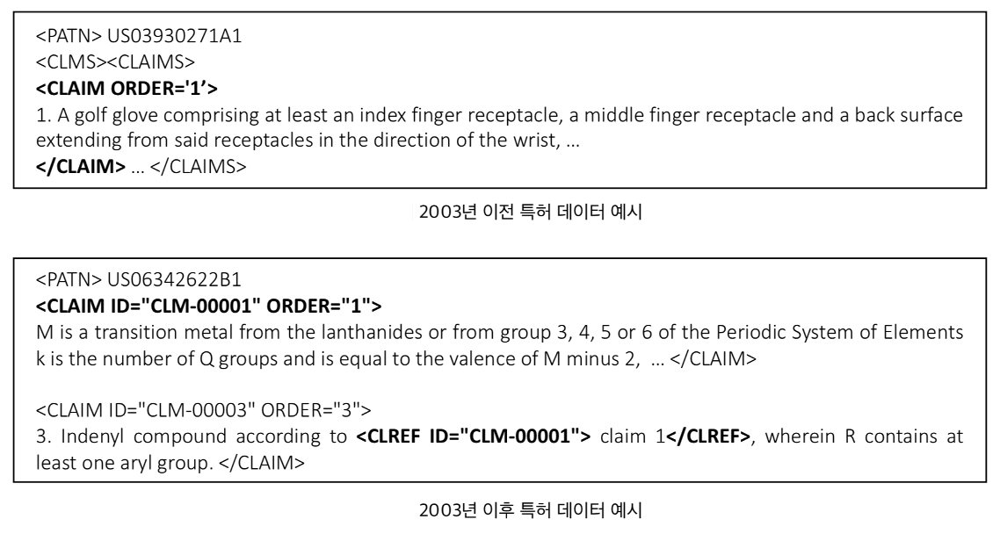
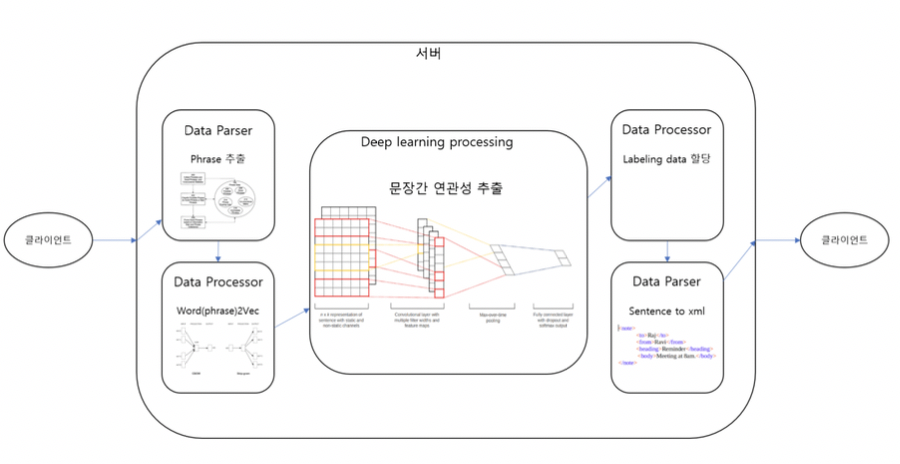
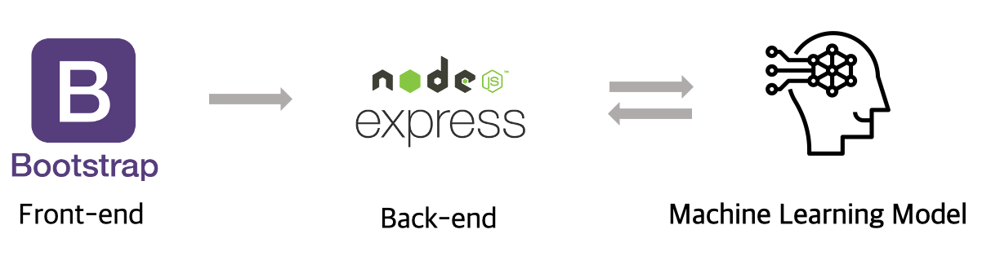

# 특허의 종속 청구항 인식 개선

## 프로젝트 개요
4 차 산업혁명 시대를 맞이하여 기술은 점점 빠르게 변화하고 발전하고 있다. 이러한 시대의 중심에서 기술의 권리를 정의하고 보호하는 일은 매우 중요하다. 특허 권리 범위의 정확한 해 석을 위해서는 권리범위에 대한 상위/하위 포함 관계의 명확한 구분이 필요하다.

## 프로젝트 목표
현재 미국의 특허는 XML 태그형식으로 이루어져 인용관계가 명시되어 있다. 그러나 2003년 이전의 특허에는 이러한 관계가 표현되어 있지 않다. 따라서 본 프로젝트에서는 2003년 이후의 인용관계가 구분된 특허를 학습한 모델을 기반으로 특허의 인용관계를 들여쓰기 형태로 시각화 한다. 추가로 특허의 성과지표별 주요 단어를 추출해 시각화한다. 사용된 학습모델은 CNN, [BERT](https://github.com/google-research/bert), 랜덤포레스트이다. 

## 특허의 성과지표
실제로 사용된 특허의 성과지표에 대한 설명은 다음과 같다. [출처](https://www.kipo.go.kr/kpo/MainApp)

Fowoard Citation : 인용 수
IPC : 특허분류코드
Claim : 청구항 수
Family Patent : 패밀리 인용 수(국외)

## 프로젝트 설계도 및 아키텍쳐
먼저 학습 모델의 설계도는 다음과 같다. 태그가 없는 특허 데이터 문서를 입력하면 서버에서 데이터 파싱 작업을 거친 뒤, 데이터 프로세서에서 전처리 과정을 거친다. 여기서는 인용항 앞 뒤의 단어를 추출한다. 다음으로 딥러닝 학습을 진행하며, 여기서는 BERT 전이학습을 이용해 종속 여부를 얻을 수 있게 된다. 후에는 종속여부에 따라 라벨링이 부여되고, [claim + 인용항 번호] 형식으로 인용항을 구분해낸다. 

다음은 이러한 학습모델을 이용한 서비스 아키텍쳐이다. 학습모델을 수행하는 백엔드가 따로 있으므로 프론트엔드에서는 특허데이터를 받아주고 백엔드에서는 이를 학습모델 서버로 학습을 요청한다. 후에 머신러닝 모델 백엔드의 결과를 받아와 프론트에 출력해준다. 

## 팀원
- [박주연](https://github.com/ju-yeon): 웹 백엔드 구현,  시각화 전처리 
- [신예지](https://github.com/gjsld1): 웹 프론트엔드 구현, 시각화 전처리
- [김민수](https://github.com/duqrlpig): 모델 학습 진행(BERT, 랜덤포레스트)

## 기타 URL
* 학습 모델 코드 <https://github.com/duqrlpig/patent_ml_project>
(학습모델 코드는 해당 깃헙이 개설되기 이전부터 진행되어 또 다른 깃헙 레퍼지토리를 이용하였다. 관련 내용은 다음 URL을 통해 확인할 수 있다. )

* 웹 어플리케이션 사용: /src의 README 참조
* 프로젝트 진행 사황: /docs의 README 참조

## 파일구조
해당 깃헙의 구조는 다음과 같다. 

- src: 프로젝트 전체 소스
- doc: 프로젝트 진행 과정
- data: 프로젝트 학습 시 출력되는 데이터
